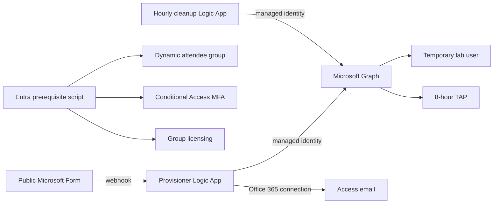

# A365 Hub

### Agentic identity and security — from first agent to incident response

[](https://learn.microsoft.com/powershell/)
[](https://learn.microsoft.com/entra/agent-id/)
[](https://learn.microsoft.com/azure/logic-apps/)
[](docs/module-roadmap.md)
[](LICENSE)

A365 Hub is an open workshop kit for teaching **agentic identity**, **Microsoft Entra
Agent ID**, and **Microsoft Agent 365**. It combines a full-day curriculum with a
repeatable, secret-less attendee onboarding platform and an honest roadmap for the labs,
detections, and capture-the-flag content still being built.

> [!WARNING]
> This project creates temporary identities and can grant access to security telemetry.
> Use a **dedicated lab tenant only**—never a production tenant.

## Start here

| Goal | Guide |
|------|-------|
| Understand the workshop | [Project outline](docs/00-project-outline.md) |
| Deliver the full day | [Facilitator agenda](docs/01-full-day-workshop.md) |
| Present Module 1 | [Interactive click-through deck](https://cyberlorians.github.io/a365-hub/) |
| Build the lab environment | [Deployment runbook](docs/05-onboarding-deployment-runbook.md) |
| Deploy attendee onboarding | [Logic App quick start](labs/logic-app/README.md) |
| See what is finished | [Module roadmap](docs/module-roadmap.md) |
| Review research sources | [Grounding index](grounding/sources.md) |

## What is ready today

### Workshop infrastructure — working

- Public Microsoft Form intake with webhook-based provisioning.
- Managed-identity Logic App that creates a temporary attendee and issues a TAP.
- Office 365 connector delivery of sign-in instructions.
- Hourly cleanup Logic App for expired workshop accounts.
- Idempotent Entra setup for the dynamic group, Conditional Access MFA policy, and
	best-effort group-based licensing.
- Full deployment, permission, teardown, XDR URBAC, and Sentinel RBAC tracking.

### Curriculum — being modularized

| Module | Theme | Status |
|--------|-------|--------|
| 1 | E7 and Agent 365 value story | 🟢 Simple interactive deck + complete teaching package; dry run pending |
| 2 | Anatomy of Entra Agent ID | 📋 Planned |
| 3 | Portal walkthrough | 📋 Planned |
| 4 | Attack paths and blast radius | 📋 Planned |
| 5 | Detect, respond, and govern | 🟡 Research/runbook ready; detections pending |
| 6 | Capture the Flag | 📋 Planned |

The intended file boundaries, acceptance criteria, and help-wanted items are tracked in
the [module development roadmap](docs/module-roadmap.md). Infrastructure being complete
does **not** mean the teaching modules are complete.

## Architecture



The Graph operations use **system-assigned managed identities**: there is no application
secret or certificate to store and rotate. The Forms and mail connections use delegated
OAuth and require one-time authorization by their owners.

## Quick deployment

### Prerequisites

- Dedicated Microsoft Entra lab tenant and Azure subscription.
- PowerShell 7+, Azure CLI, and Microsoft Graph PowerShell authentication module.
- Azure Contributor or Owner for deployment; Global Administrator or Privileged Role
	Administrator for Graph app-role assignment.
- Temporary Access Pass authentication method enabled.
- A Microsoft Form with full-name and email fields.
- Appropriate workshop licenses and, for hunting labs, Defender XDR and Sentinel.

### 1. Configure Entra

```powershell
Set-Location ./labs/logic-app
./Setup-EntraPrereqs.ps1 -DryRun
./Setup-EntraPrereqs.ps1 `
		-PolicyState enabled `
		-ExcludeUserUpns "breakglass@contoso.onmicrosoft.com"
```

The script safely skips missing license SKUs and reports other Conditional Access
policies that may need a **manually tested** attendee-group exclusion.

### 2. Discover the form metadata

```powershell
./Get-FormMetadata.ps1 -FormUrl "<microsoft-form-design-url>"
```

### 3. Deploy the pipeline

```powershell
./deploy.ps1 `
		-SubscriptionId "<subscription-id>" `
		-ResourceGroup "A365-Workshop" `
		-Location "eastus2" `
		-UpnDomain "contoso.onmicrosoft.com" `
		-FormId "<form-id>" `
		-FullNameQuestionId "<question-id>" `
		-EmailQuestionId "<question-id>"
```

The deployment pauses once for the Forms and Office 365 OAuth connections to be
authorized. Continue with the [complete deployment and validation
instructions](labs/logic-app/README.md).

## Repository map

| Path | Contents |
|------|----------|
| [docs](docs/) | Curriculum, agendas, onboarding architecture, and operations runbook |
| [grounding](grounding/) | Research notes, source summaries, and reference links |
| [slides](slides/) | Markdown teaching-deck sources |
| [labs/logic-app](labs/logic-app/) | Repeatable Forms → Logic App → user/TAP deployment |
| [labs/provisioning](labs/provisioning/) | Delegated CSV provisioning and teardown fallback |
| [detections](detections/) | Detection-pack contracts and future KQL content |

## Security model

The default dynamic attendee group is populated by `department = workshop`. When a
**public** form feeds that group, anyone able to submit it may ultimately receive the
group's licenses and permissions. For workshops that expose XDR or Sentinel telemetry,
use a separate approved/static SOC-read group or otherwise gate enrollment.

Review [SECURITY.md](SECURITY.md) and the runbook's threat-boundary notes before deploying.

## Contributing

Contributions are welcome—especially module decks, portal walkthroughs, KQL detections,
safe attack simulations, and CTF challenges. See [CONTRIBUTING.md](CONTRIBUTING.md).

## License and attribution

Code and original project documentation are available under the [MIT License](LICENSE).
Third-party research remains the property of its respective authors; links and summaries
are cataloged in [grounding/sources.md](grounding/sources.md).
