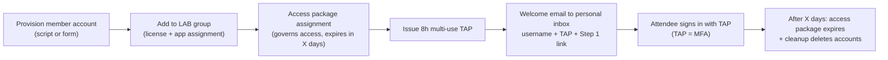

# Onboarding & Access (Repeatable Deploy)

How to bring workshop attendees into the lab tenant with **MFA protection**, **no BYOD**, and
**automatic cleanup** — governed by an Entra **access package**. Designed to be cloned from GitHub and
run by anyone.

> **MFA question, settled:** A **Temporary Access Pass (TAP) *is* MFA.** It's a strong,
> MFA-satisfying credential, so your "require MFA" Conditional Access policy is met by the TAP. You
> keep MFA protection **and** avoid the Authenticator app / personal phone. Use TAP for this workshop;
> use Authenticator only for accounts that outlive the day.

---

## What the attendee experiences
1. Receives a welcome email (personal inbox) with **username + 8-hour TAP + "Start Lab — Step 1" link**.
2. Goes to the sign-in page, enters username, enters the TAP — **no password, no phone**.
3. TAP satisfies MFA → they land in the lab and start Step 1.



---

## Prerequisites (one-time per lab tenant)
- A dedicated **throwaway lab tenant** (never mix with production).
- Licenses available for the workshop (M365 Copilot / Agent 365 / E5 as required) for group-based licensing.
- Roles to deploy: **Global Administrator** or the combination of **User Administrator** +
  **Authentication Administrator** + **Identity Governance Administrator**.
- Microsoft.Graph PowerShell module (`Install-Module Microsoft.Graph`).

---

## Deploy — step by step

### 1. Turn off Security Defaults, require MFA via Conditional Access
- Entra admin center → **Overview → Properties → Manage security defaults → Disabled**.
- **Conditional Access → New policy**: assign the LAB group, target **All resources**, Grant =
  **Require multifactor authentication**. **Do NOT** set an authentication strength of
  *phishing-resistant* — a TAP is not phishing-resistant and would be blocked. Standard "require MFA" is correct.

### 2. Enable Temporary Access Pass
- Entra admin center → **Authentication methods → Temporary Access Pass → Enable**, target the LAB group.
- Settings: Minimum lifetime ≤ 8h, **Maximum lifetime ≥ 8h**, **One-time use = No** (allow multi-use so a
  single TAP works for every re-auth during the day).

### 3. Create the LAB group (carries license + app)
- New **security group** `LAB-Workshop-Users`.
- Assign **group-based licensing** (Copilot / Agent 365 / E5) to the group.
- Assign the Copilot Studio / lab **enterprise app** to the group (user assignment).

### 4. Create the access package (governs lifecycle)
- **Identity Governance → Entitlement management → Catalogs** → new catalog `Workshop`; add the
  `LAB-Workshop-Users` group as a resource.
- **Access packages** → new package `A365 Workshop Access`; add the group (Member role).
- **Lifecycle → Expiration**: expire assignments **after X days** (e.g., 2). Add an **access review** if desired.
- Optional (external identities only): catalog/EM setting to **block sign-in and delete** external users
  X days after they have no assignments. *(Note: this auto-delete applies to external/guest users, not
  internal member accounts — internal accounts are removed by the cleanup script in teardown.)*

### 5. Provision accounts + TAP + welcome email
Run the reference script (see `../labs/provisioning/`) or do it via a Forms→Power Automate front end.
Core Graph actions per attendee:

```powershell
Connect-MgGraph -Scopes "User.ReadWrite.All","Group.ReadWrite.All","UserAuthenticationMethod.ReadWrite.All"

# 1) Create a cloud-only member account (otherMail = their personal address)
$pw = @{ forceChangePasswordNextSignIn = $false; password = [guid]::NewGuid().ToString() }
$u = New-MgUser -DisplayName "Workshop User 01" -MailNickname "wksp01" `
     -UserPrincipalName "wksp01@<labtenant>.onmicrosoft.com" -AccountEnabled `
     -PasswordProfile $pw -OtherMails @("attendee-personal@example.com") `
     -Department "workshop"

# 2) Add to the LAB group (license + app flow from group)
New-MgGroupMember -GroupId $LabGroupId -DirectoryObjectId $u.Id

# 3) Issue an 8-hour, multi-use TAP (this is their MFA)
$tap = New-MgUserAuthenticationTemporaryAccessPassMethod -UserId $u.Id `
       -BodyParameter @{ lifetimeInMinutes = 480; isUsableOnce = $false }
$tap.TemporaryAccessPass   # put this + UPN + Step 1 link in the welcome email
```

Then email the attendee's **personal inbox** (`OtherMails`) the UPN, the TAP, and the Lab Step 1 link.
(Automate the email with Power Automate/Graph `sendMail`, or the Lifecycle Workflows "generate TAP +
send welcome email" joiner task if you prefer the fully governed route.)

### 6. Assign the access package
Assign attendees to `A365 Workshop Access` (direct assignment, or enable self-service request with
auto-approval so latecomers self-onboard). Expiration now governs their access automatically.

---

## Teardown (repeatable)
- **Access package expiry** removes group membership → license + app access revoked automatically after X days.
- **Delete the member accounts** (internal accounts aren't auto-deleted by EM):

```powershell
Get-MgUser -Filter "department eq 'workshop'" -All | ForEach-Object { Remove-MgUser -UserId $_.Id }
```
- Delete the provisioning **app registration/managed identity** used by the automation (it holds
  Tier-0-grade Graph permissions — least-privilege it while live, remove it after).
- Confirm no leftover **agent identities / blueprints** built during the labs (see Block 8 in the agenda).

---

## Why this is safe and on-message
- **MFA is enforced** the whole time (TAP satisfies the CA MFA requirement).
- **No BYOD** — attendees never install Authenticator or use a personal phone.
- **Governed + auto-expiring** — the access package is itself a live demo of the Entra ID Governance
  features you're upselling.
- **Repeatable** — clone this repo, follow steps 1–6, run the teardown. Anyone can deliver it.

## Repeatability checklist
- [ ] Lab tenant created; licenses available.
- [ ] Security Defaults off; CA "require MFA" policy on LAB group (not phishing-resistant).
- [ ] TAP enabled (multi-use, ≥8h) on LAB group.
- [ ] `LAB-Workshop-Users` group with group-based licensing + app assignment.
- [ ] Access package `A365 Workshop Access` with X-day expiration.
- [ ] Provisioning script/form tested end to end (account → TAP → welcome email).
- [ ] Teardown script tested; provisioning app removed.
