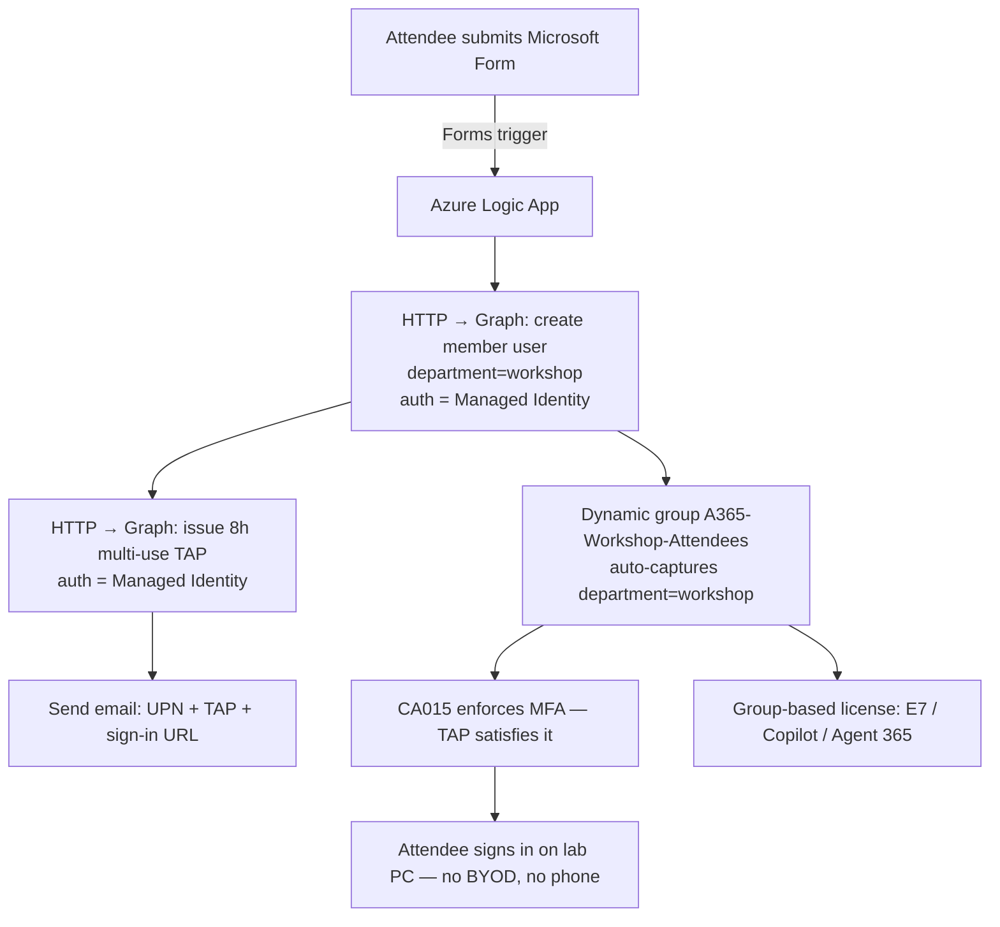

# 04 — Form-Driven Onboarding Flow (Logic App + Managed Identity)

This is the automated, **secret-less** attendee onboarding pipeline. An attendee
submits a Microsoft Form; an Azure Logic App (authenticating with its own
**system-assigned managed identity**) creates their account and issues a Temporary
Access Pass, then emails them sign-in instructions. No app registration, no client
secret, nothing to rotate or leak.

> Why not Power Automate? Power Automate cloud flows run in the Power Platform and
> **cannot use a managed identity** — they'd require a stored secret/certificate.
> An Azure Logic App runs on Azure compute, so it gets a managed identity and calls
> Graph with zero stored credentials. Same drag-and-drop designer, same Forms trigger.

## Architecture



## Prerequisites (already in place in the lab tenant)

| Component | Status | Notes |
|---|---|---|
| Security Defaults | Disabled | lets Conditional Access run |
| TAP policy | Enabled, all users, multi-use, 480 min max | TAP = MFA |
| Dynamic group `A365-Workshop-Attendees` | Created | rule: `(user.department -eq "workshop")` |
| CA policy `CA015 - A365 Workshop Require MFA` | Enabled | scoped to the dynamic group, `mcrane` excluded, grant = MFA |

## Build steps

### 1. Create a Consumption Logic App
Azure portal → **Logic apps** → Add → **Consumption** plan → same region as the tenant.

### 2. Enable the system-assigned managed identity
Logic App → **Identity** → **System assigned** → **On** → Save. Copy the **Object (principal) ID**.

### 3. Grant the managed identity Graph app roles (secret-less)
Run once as a Global Admin. This is the *same* `appRoleAssignment` pattern used for
any service principal — we just target the Logic App's MI instead of an app registration.

```powershell
Connect-MgGraph -Scopes "AppRoleAssignment.ReadWrite.All","Application.Read.All" -NoWelcome

$miObjectId = "<MANAGED-IDENTITY-OBJECT-ID>"   # from step 2
$graphSp = (Invoke-MgGraphRequest -Method GET `
    -Uri "https://graph.microsoft.com/v1.0/servicePrincipals?`$filter=appId eq '00000003-0000-0000-c000-000000000000'").value[0]

# Only the roles the flow actually needs
$roles = @{
    "User.ReadWrite.All"                     = "741f803b-c850-494e-b5df-cde7c675a1ca"
    "UserAuthenticationMethod.ReadWrite.All" = "50483e42-d915-4231-9639-7fdb7fd190e5"
}
foreach ($r in $roles.GetEnumerator()) {
    $body = @{ principalId = $miObjectId; resourceId = $graphSp.id; appRoleId = $r.Value } | ConvertTo-Json
    Invoke-MgGraphRequest -Method POST `
        -Uri "https://graph.microsoft.com/v1.0/servicePrincipals/$miObjectId/appRoleAssignments" -Body $body
    Write-Host "Granted $($r.Key)"
}
```

> Least privilege: the flow only needs `User.ReadWrite.All` (create accounts) and
> `UserAuthenticationMethod.ReadWrite.All` (issue TAPs). No `Group.*` — the dynamic
> group evaluates membership on its own.

### 4. Build the Microsoft Form
Fields:
- **Full name** (text) — becomes `displayName`
- **Company** (text, optional) — for reporting
- **Consent** (choice) — "I agree to the lab account terms"

Keep it internal to the workshop tenant. The Form owner triggers the flow.

### 5. Logic App designer

**Trigger:** *Microsoft Forms — When a new response is submitted* → *Get response details*.

**Action A — Create user (HTTP):**
- Method: `POST`
- URI: `https://graph.microsoft.com/v1.0/users`
- Authentication: **Managed identity** → Audience `https://graph.microsoft.com`
- Body:
  ```json
  {
    "accountEnabled": true,
    "displayName": "@{outputs('Get_response_details')?['body/fullName']}",
    "mailNickname": "@{toLower(replace(outputs('Get_response_details')?['body/fullName'],' ',''))}",
    "userPrincipalName": "@{toLower(replace(outputs('Get_response_details')?['body/fullName'],' ',''))}@<yourtenant>.onmicrosoft.com",
    "department": "workshop",
    "usageLocation": "US",
    "passwordProfile": {
      "forceChangePasswordNextSignIn": true,
      "password": "@{guid()}Aa1!"
    }
  }
  ```

**Action B — Issue TAP (HTTP):**
- Method: `POST`
- URI: `https://graph.microsoft.com/v1.0/users/@{body('Create_user')?['id']}/authentication/temporaryAccessPassMethods`
- Authentication: **Managed identity** → Audience `https://graph.microsoft.com`
- Body:
  ```json
  { "lifetimeInMinutes": 480, "isUsableOnce": false }
  ```

**Action C — Email the attendee** (Office 365 Outlook *Send an email*):
- To: the presenter / attendee's provided email
- Body: their UPN, the TAP value `@{body('Issue_TAP')?['temporaryAccessPass']}`,
  the sign-in URL `https://portal.office.com`, and a note that the pass is valid 8 hours.

### 6. Result
On submit: account created → dynamic group auto-captures it → CA015 requires MFA →
TAP satisfies MFA → attendee signs in on a lab PC with **no phone and no BYOD**.
No credential is stored anywhere in the pipeline.

## Teardown
Member accounts are **not** auto-deleted (access-package auto-expiry only applies to
guests). Run [teardown.ps1](../labs/provisioning/teardown.ps1) after the workshop, or
add a scheduled Logic App that calls
`DELETE /users` for everyone with `department eq 'workshop'` — again via managed identity.

## Manual / bulk alternative (also secret-less)
For pre-provisioning without the form, use
[provision-attendees.ps1](../labs/provisioning/provision-attendees.ps1) with a CSV.
It uses **your** delegated `Connect-MgGraph` sign-in — no secret either.
