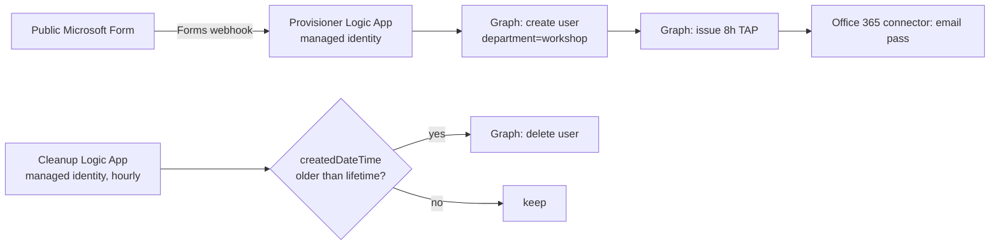

# 05 — Onboarding Deployment Runbook & Permission Tracking

Authoritative, end-to-end record of the **secret-less attendee onboarding pipeline**:
every component, every permission *needed to deploy it*, and every permission
*granted to it at runtime*. Use this to deploy into a new tenant and to audit/revoke.

Related: build details in [04-onboarding-flow.md](04-onboarding-flow.md); templates and
scripts in [../labs/logic-app/](../labs/logic-app/) with its own
[README](../labs/logic-app/README.md).

---

## 1. What the pipeline is



Two Azure Logic Apps, each with its **own system-assigned managed identity**. No app
registration, no client secret, nothing to rotate. Graph is called with the MI token;
email is sent through an Office 365 API connection.

---

## 2. Components created

| # | Component | Type | Name (this tenant) |
|---|-----------|------|--------------------|
| 1 | Microsoft Form | Forms | `A365 Workshop - Lab Access Request` |
| 2 | Forms API connection | `Microsoft.Web/connections` | `microsoftforms` |
| 3 | Office 365 API connection | `Microsoft.Web/connections` | `office365-1` |
| 4 | Provisioner Logic App | `Microsoft.Logic/workflows` | `A365-Workshop-Provisioner` |
| 5 | Cleanup Logic App | `Microsoft.Logic/workflows` | `A365-Workshop-Cleanup` |

---

## 3. Permissions the DEPLOYER (operator) needs

You cannot grant what you don't have. The person running `deploy.ps1` needs all of the
following **before** starting.

| Scope | Permission | Why | Minimum role that has it |
|-------|-----------|-----|--------------------------|
| Azure subscription / RG | Create Logic Apps + API connections + resource group | Deploy the ARM templates | **Contributor** (or Owner) on the target subscription or RG |
| Microsoft Entra | Create `appRoleAssignment` on a service principal (assign Graph app roles to the MIs) | Grant the managed identities their Graph roles | **Global Administrator** or **Privileged Role Administrator** |
| Microsoft Forms | Owner/co-owner of the form | Authorize the Forms connection; read responses | Form **owner** |
| Exchange Online | A licensed mailbox | Authorize the Office 365 connection; send the pass email | Any **mailbox-enabled** account |

> The Graph *app-role assignment* step specifically requires the Graph permissions
> `AppRoleAssignment.ReadWrite.All` + `Application.Read.All`, which a Global Admin holds.
> `deploy.ps1` performs it with your `az login` token.

`Setup-EntraPrereqs.ps1` uses an interactive Microsoft Graph PowerShell sign-in and
requests these delegated scopes:

| Delegated scope | Purpose |
|-----------------|---------|
| `Group.ReadWrite.All` | Create/read the dynamic attendee security group |
| `Policy.ReadWrite.ConditionalAccess` | Create/read the workshop MFA policy |
| `LicenseAssignment.ReadWrite.All` | Assign available tenant SKUs to the group |
| `Organization.Read.All`, `Directory.Read.All` | Discover subscribed SKUs and directory objects |
| `User.Read.All` | Resolve explicitly excluded break-glass UPNs |

Use an administrator authorized to consent to these scopes. They are permissions of the
interactive operator session—not standing permissions granted to either Logic App.

---

## 4. Permissions GRANTED to each managed identity (runtime)

These are the only standing privileges the pipeline holds. All are **Microsoft Graph
application** app roles (app-only), granted via `appRoleAssignment` to the Logic App's MI.

### 4a. Provisioner — `A365-Workshop-Provisioner`

| Graph app role | Role ID | Needed for | Status |
|----------------|---------|-----------|--------|
| `User.ReadWrite.All` | `741f803b-c850-494e-b5df-cde7c675a1ca` | `POST /users` — create the lab account | **Required** |
| `UserAuthenticationMethod.ReadWrite.All` | `50483e42-d915-4231-9639-7fdb7fd190e5` | `POST /users/{id}/authentication/temporaryAccessPassMethods` — issue the TAP | **Required** |

The current deployment does **not** grant `Mail.Send`; email uses the delegated Office
365 connector. Remove that Graph role if upgrading an environment created by an older
version of this project.

### 4b. Cleanup — `A365-Workshop-Cleanup`

| Graph app role | Role ID | Needed for | Status |
|----------------|---------|-----------|--------|
| `User.ReadWrite.All` | `741f803b-c850-494e-b5df-cde7c675a1ca` | `GET /users` (filter `department eq 'workshop'`) + `DELETE /users/{id}` | **Required** |

> `User.ReadWrite.All` **cannot** delete users holding privileged admin roles, so the
> cleanup can only ever remove plain `department=workshop` lab accounts.

### 4c. Connector connections (delegated, not managed identity)

The two API connections authenticate as the **user who authorized them**, not as a
managed identity. Track who that is.

| Connection | Acts as | Effective permission |
|-----------|---------|----------------------|
| `microsoftforms` | The form owner who signed in during authorization | Read responses for forms that account owns |
| `office365-1` | The mailbox account that signed in during authorization | Send mail **as that mailbox** (the "From" of the pass email) |

---

## 5. Deploy steps (repeatable, any tenant)

### Step 0 — Prerequisites
- `az login` as an account meeting §3.
- Entra: TAP policy enabled (Authentication methods → Temporary Access Pass), max
  lifetime ≥ your intended value. Optional: dynamic group `(user.department -eq "workshop")`
  + Conditional Access for the sign-in experience (see [04](04-onboarding-flow.md)).
- A Microsoft Form with a **full name** field and an **email** field. Set audience to
  *"Anyone can respond"* for external attendees.

### Step 1 — Discover the form IDs
```powershell
cd labs/logic-app
./Get-FormMetadata.ps1 -FormUrl "https://forms.office.com/Pages/DesignPageV2.aspx?...&id=<formId>"
```
Record: **Form ID**, **full-name question ID**, **email question ID**.

### Step 2 — Deploy everything
```powershell
./deploy.ps1 `
    -SubscriptionId "<sub-guid>" `
    -ResourceGroup  "A365-Workshop" `
    -Location       "eastus2" `
    -UpnDomain      "<tenant>.onmicrosoft.com" `
    -FormId             "<formId>" `
    -FullNameQuestionId "<id>" `
    -EmailQuestionId    "<id>"
```
`deploy.ps1` does, in order:
1. `az account set` → `az group create`.
2. Deploy `connections.template.json` (Forms + Office 365 connections).
3. **PAUSE** — you authorize both connections in the portal (§4c), then press ENTER.
4. Deploy `provisioner-forms.template.json` → prints the provisioner MI principalId.
5. Deploy `cleanup.template.json` → prints the cleanup MI principalId.
6. Grant the Graph app roles from §4a/§4b to each MI (idempotent).

### Step 3 — The one manual step (connection authorization)
Azure Portal → the resource group → open each **API Connection** → **Edit API
connection** / **Authorize** → sign in (Forms as the form owner; Office 365 as the
sending mailbox) → **Save**. Both must show **Connected**.

---

## 6. Verification

```powershell
# Submit a test response, then check the provisioner run:
#   Portal > Logic app A365-Workshop-Provisioner > Run history
#   Expect: Get_response_details > Create_user > Issue_TAP > Send_email = all green
```
- Attendee receives the email (UPN + TAP, valid 8h).
- Confirm the account: `department = workshop`, and it disappears within
  `AccountLifetimeMinutes + recurrenceHours` after creation (cleanup).
- Audit the MI grants any time:
  Portal → Entra → Enterprise applications → *(filter Managed Identities)* → the Logic
  App → Permissions; or `GET /servicePrincipals/{miId}/appRoleAssignments`.

---

## 7. Deployment inventory worksheet

Record each environment's generated identifiers in a secure operational system. Do not
commit live tenant identifiers or attendee information to a public fork.

| Item | Value to record |
|------|-----------------|
| Tenant ID | `<tenant-id>` |
| Azure subscription ID | `<subscription-id>` |
| Resource group / region | `<resource-group>` / `<region>` |
| Form ID | `<form-id>` |
| Full-name question ID | `<question-id>` |
| Email question ID | `<question-id>` |
| Provisioner MI principal ID | `<generated-by-deployment>` |
| Cleanup MI principal ID | `<generated-by-deployment>` |
| Attendee group object ID | `<generated-by-Setup-EntraPrereqs.ps1>` |
| Public form link | `https://forms.office.com/Pages/ResponsePage.aspx?id=<form-id>` |

**Expected app roles:**
- Provisioner MI → `User.ReadWrite.All`, `UserAuthenticationMethod.ReadWrite.All`
- Cleanup MI → `User.ReadWrite.All`

---

## 8. Attendee group SOC read access — MANUAL (URBAC + Sentinel)

The detection / hunting lab needs attendees to **read** security data in **Microsoft
Defender XDR** (security.microsoft.com) and **Microsoft Sentinel**. This is granted to
the attendee group and **cannot be fully scripted** — Defender Unified RBAC (URBAC) is
portal-only. Do §8a by hand; §8b can be portal or CLI.

**Group to grant:** `A365-Workshop-Attendees`, dynamic rule
`(user.department -eq "workshop")`. Obtain its object ID from
`Setup-EntraPrereqs.ps1` or the Entra admin center.

> **SECURITY CAVEAT:** this group **auto-populates from the PUBLIC form**. Granting it
> XDR + Sentinel read means *anyone who submits the form* gains read access to the
> tenant's security telemetry. Acceptable in a **dedicated lab tenant only**. For a
> tighter boundary, grant SOC read to a **separate static group** and add attendees to
> it manually instead of using the dynamic attendee group.

### 8a. Defender XDR — Unified RBAC (read, all products)  *(portal only)*
1. **security.microsoft.com → System → Permissions → Roles** (Microsoft Defender XDR /
   Unified RBAC). If prompted, **activate** Unified RBAC per workload
   (Settings → Endpoints / Identities / Email & collaboration / Cloud Apps → turn on
   *“Microsoft Defender XDR Unified role-based access control”*).
2. **Create custom role** → name e.g. `A365 Workshop - XDR Read Only`.
3. Under **Permissions**, grant **Read only**:
   - Security operations → **Security data basics = Read**; **Alerts / Incidents = Read**.
   - Security posture → **Posture management = Read**.
   - Authorization and settings → **System settings = Read (view only)**.
   - Do **NOT** grant any Manage / Respond / Live-response permission.
4. **Assignments** → add group **A365-Workshop-Attendees**; set **Data sources = All**
   (Defender for Endpoint, Office 365, Identity, Cloud Apps, Vulnerability Management)
   so the read spans every product.
5. **Save.** Allow a few minutes to propagate.

### 8b. Microsoft Sentinel — Azure RBAC (read)
Sentinel uses **Azure RBAC**, so this is a role assignment on the workspace.
1. Azure Portal → the target Sentinel **Log Analytics workspace**.
2. **Access control (IAM) → Add role assignment**.
3. Role: **Microsoft Sentinel Reader** → assign to group **A365-Workshop-Attendees**
   (covers reading incidents, workbooks, hunting queries, and the underlying logs).
4. Scope: the **workspace** (least privilege). Review + assign.

CLI equivalent for §8b:
```powershell
az role assignment create `
  --assignee-object-id "<attendee-group-object-id>" `
  --assignee-principal-type Group `
  --role "Microsoft Sentinel Reader" `
  --scope "/subscriptions/<subscription-id>/resourceGroups/<resource-group>/providers/Microsoft.OperationalInsights/workspaces/<workspace-name>"
```

### 8c. Checklist
- [ ] Unified RBAC activated for all workloads
- [ ] Custom **read** role created + assigned to the group, **Data sources = All**
- [ ] **Microsoft Sentinel Reader** assigned to the group on the workspace
- [ ] Verified: a test attendee opens security.microsoft.com **and** Sentinel read-only

---

## 9. Attendee licensing — SCRIPTABLE (group-based licensing)

Attendees can't use Copilot / Agent 365 / Defender features without licenses. Assign them
via **group-based licensing** on the attendee group so every provisioned user inherits
them automatically. The provisioner already sets `usageLocation = US` (licensing requires
a usage location), so new accounts license cleanly.

`Setup-EntraPrereqs.ps1` discovers the requested SKUs and assigns every available one.
Missing SKUs are reported and skipped so the rest of the setup can continue. Its default
workshop bundle is:

| Product | SKU part number |
|---------|-----------------|
| Microsoft 365 E5 (no Teams) | `Microsoft_365_E5_(no_Teams)` |
| Microsoft 365 Copilot | `Microsoft_365_Copilot` |
| Agent 365 | `AGENT_365` |
| Teams Enterprise | `Microsoft_Teams_Enterprise_New` |

**Automated path:** run `Setup-EntraPrereqs.ps1` as described in §10. Override
`-LicenseSkuPartNumbers` if your tenant uses a different bundle.

**Portal fallback:**
1. Entra admin center → **Groups** → `A365-Workshop-Attendees` → **Licenses** → **Assignments**.
2. Add the SKUs above; review the service plans (disable anything not needed).
3. **Save.** Every current + future member inherits them automatically.
4. Confirm enough **available seats** (Billing → Licenses) and cap attendance to the
  least-available required SKU.

> **Timing:** group-based license assignment is async (seconds–minutes) and only fires
> *after* the dynamic-group membership evaluates. A brand-new attendee may briefly lack
> a license right after submitting the form; it lands shortly after. Do the license
> assignment on the group **before** the event, not per-user.

---

## 10. Full environment — everything required (rebuild & dismantle order)

Complete dependency list — automated **and** manual — so you can tear it all down and
rebuild from zero.

**Legend:** 🤖 automated by `deploy.ps1` · 🅴 scriptable by `Setup-EntraPrereqs.ps1` · ✋ manual · 🏗️ platform must already exist

| Layer | Item | How |
|-------|------|-----|
| 🏗️ Platform | Microsoft Sentinel workspace (`DIBSecCom`) onboarded | pre-existing |
| 🏗️ Platform | Defender XDR onboarded (Endpoint / Identity / O365 / Cloud Apps) | pre-existing |
| 🏗️ Platform | Power Platform / Copilot Studio environment (agent-building labs) | pre-existing |
| ✋ Entra | Security Defaults **disabled** (so Conditional Access runs) | portal |
| ✋ Entra | TAP auth-method policy **enabled** (multi-use, max ≥ 480 min) | portal |
| 🅴 Entra | Dynamic group `A365-Workshop-Attendees` (`user.department -eq "workshop"`) | `Setup-EntraPrereqs.ps1` |
| 🅴 Entra | Conditional Access `CA015` (require MFA, scoped to group, admin excluded) | `Setup-EntraPrereqs.ps1` |
| 🅴 Licensing | Group-based licensing: E5 + Copilot + Agent 365 + Teams (§9) | `Setup-EntraPrereqs.ps1` (best-effort) |
| ✋ Entra | Exclude the attendee group from *other* CA policies as needed | portal (script lists them; **test manually**) |
| ✋ Forms | The Microsoft Form (full-name + email fields), audience *Anyone can respond* | forms.office.com |
| 🤖 Azure | RG + 2 API connections + provisioner + cleanup Logic Apps | `deploy.ps1` |
| ✋ Azure | Authorize the 2 API connections (OAuth consent) | portal (deploy.ps1 pauses) |
| 🤖 Graph | Managed-identity app-role grants (§4) | `deploy.ps1` |
| ✋ SOC | Defender XDR URBAC read role + Sentinel Reader (§8) | portal |

### Rebuild order (fresh tenant)
1. Confirm platforms onboarded (🏗️): Sentinel, Defender XDR, Power Platform / Copilot Studio.
2. Entra base (manual, portal): **disable Security Defaults** → **enable the TAP auth-method policy**.
3. **Run `Setup-EntraPrereqs.ps1`** (as Global Admin): creates the dynamic group, the CA MFA policy, and group-based licensing (§9). Preview with `-DryRun` first. Then **review its printed list of other CA policies** and exclude the attendee group where needed — **test manually**.
4. **Create the Form**; run `Get-FormMetadata.ps1` to get the form + question IDs.
5. **`deploy.ps1`** (connections + Logic Apps + MI roles); **authorize** the 2 connections when it pauses.
6. **SOC access** (§8): URBAC read role + Sentinel Reader.
7. **End-to-end test**: submit form → account + TAP + email → sign in → read in XDR / Sentinel.

### Dismantle order (safe)
1. **Disable the provisioner Logic App first** (stops new signups).
2. **Delete workshop users**: run [teardown.ps1](../labs/provisioning/teardown.ps1) or let Cleanup drain them.
3. **Remove the group-based license** from the group (frees seats) — do this *before* deleting the group.
4. **Remove SOC access**: delete the URBAC custom role assignment + the Sentinel Reader assignment.
5. **`az group delete --name A365-Workshop`** (removes both Logic Apps + connections; MI role grants cascade).
6. **Delete Conditional Access** `CA015` (optional — only affects the group).
7. **Delete the dynamic group** `A365-Workshop-Attendees`.
8. **Delete the Microsoft Form** (removes its webhook subscription).
9. **Tenant-level** TAP policy / Security Defaults — leave at your tenant standard.

> **Out of scope of this repo (still your responsibility):** lab PCs / AVD for the
> no-BYOD sign-in experience, and any Copilot Studio / Agent 365 content attendees build.

---

## 11. Teardown / revocation

Remove resources:
```powershell
az group delete --name "A365-Workshop" --yes   # deletes both Logic Apps + connections
```
Deleting the Logic Apps deletes their managed identities, which cascades their
`appRoleAssignment`s automatically. To revoke a single role without deleting the app:
```powershell
# list, then delete a specific assignment
GET    /servicePrincipals/{miId}/appRoleAssignments
DELETE /servicePrincipals/{miId}/appRoleAssignments/{assignmentId}
```
Remove leftover lab accounts (also what the Cleanup app does):
[../labs/provisioning/teardown.ps1](../labs/provisioning/teardown.ps1) — deletes
`department eq 'workshop'` users.

**Legacy cleanup:** environments built from an early version may have an unused
`Mail.Send` assignment on the provisioner MI. Remove it; current deployments use the
Office 365 connector and do not grant this Graph role.

---

## 12. Hard-won gotchas

- **Forms webhook body** must be exactly
  `{ "notificationUrl": "@{listCallbackUrl()}", "eventType": "responseAdded" }`
  (lowercase `notificationUrl`, singular `eventType`) or Forms returns
  *"Invalid webhook definition"* and the subscription never registers.
- **Renaming a form question via API** requires patching **both** `title` **and**
  `formsProRTQuestionTitle`; the rendered form shows the latter.
- **Date comparison in the cleanup** uses `ticks()` (numeric), not string compare —
  ISO timestamps with/without fractional seconds sort incorrectly as strings.
