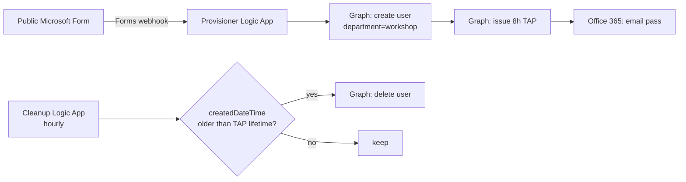

# Secret-less Onboarding Pipeline — Deploy to Any Tenant

This folder contains everything needed to stand up the **public Form → Logic App →
lab account + Temporary Access Pass (TAP) → email**, plus an **hourly cleanup** that
deletes the accounts after the TAP expires. Every Graph call uses a Logic App
**system-assigned managed identity** — no app registration, no client secret.

## Files

| File | Purpose |
|------|---------|
| `connections.template.json` | ARM: the two API connections (Microsoft Forms + Office 365 Outlook). |
| `provisioner-forms.template.json` | ARM: the Forms-triggered provisioner Logic App (create user + TAP + email). Fully parameterized (form ID, question IDs, UPN domain, TAP lifetime). |
| `cleanup.template.json` | ARM: the hourly cleanup Logic App (deletes `department eq 'workshop'` users older than the TAP lifetime). |
| `Setup-EntraPrereqs.ps1` | Idempotent Entra setup: creates the dynamic attendee group, the Conditional Access MFA policy, and group-based licensing; lists other CA policies to review. Supports `-DryRun`. |
| `Get-FormMetadata.ps1` | Helper: prints a form's ID + every question ID so you can fill in the deploy parameters. |
| `deploy.ps1` | One-shot orchestrator: deploys all three templates and grants the managed identities their Graph app roles. |
| `provisioner.template.json`, `provisioner.workflow.json`, `forms-connection.json` | Legacy HTTP-triggered version, kept for reference/fallback. |

## Architecture



## Prerequisites

- **Azure CLI** signed in (`az login`) as someone who is **Owner/Contributor** on the
  target subscription **and** a **Global Administrator** (needed to grant the Graph
  app roles).
- A **Microsoft Form** already created in the target tenant with, at minimum, a
  **full name** text field and an **email** text field. Set its audience to
  *"Anyone can respond"* if attendees are external.
- Entra prerequisites for the sign-in experience (see
  [../../docs/04-onboarding-flow.md](../../docs/04-onboarding-flow.md)): TAP policy
  enabled; optional dynamic group + Conditional Access.

## Deploy (repeatable)

### 0. Entra prerequisites (scriptable)

Create the dynamic attendee group, the Conditional Access MFA policy, and group-based
licensing. Preview first with `-DryRun`, then run for real (as a Global Administrator):

```powershell
./Setup-EntraPrereqs.ps1 -DryRun
./Setup-EntraPrereqs.ps1 -PolicyState enabled -ExcludeUserUpns "admin@<tenant>.onmicrosoft.com"
```

It is idempotent (skips anything that already exists) and, at the end, **lists your other
CA policies** so you can manually decide whether to exclude the attendee group from any of
them (external/unmanaged attendees can be blocked by device/compliance policies - test this
manually). Licensing is best-effort: SKUs that don't exist in the tenant are skipped with a
note so the script still completes.

> Still manual: `Security Defaults = disabled`, the `TAP` auth-method policy, and creating
> the Microsoft Form. See [../../docs/05-onboarding-deployment-runbook.md](../../docs/05-onboarding-deployment-runbook.md).

### 1. Get your form's IDs

```powershell
az login
./Get-FormMetadata.ps1 -FormUrl "https://forms.office.com/Pages/DesignPageV2.aspx?...&id=<yourFormId>"
```

Copy the **Form ID**, the **full-name question ID**, and the **email question ID**
from the output.

### 2. Run the deployment

```powershell
./deploy.ps1 `
    -SubscriptionId "<sub-guid>" `
    -ResourceGroup  "A365-Workshop" `
    -Location       "eastus2" `
    -UpnDomain      "<yourtenant>.onmicrosoft.com" `
    -FormId             "<formId>" `
    -FullNameQuestionId "<fullNameQuestionId>" `
    -EmailQuestionId    "<emailQuestionId>"
```

The script pauses once, after creating the API connections, so you can **authorize**
them (one-time OAuth consent) in the portal — sign in as the form owner for Forms and
as the sending mailbox for Office 365. Press ENTER to continue; it then deploys both
Logic Apps and grants the managed identities their roles.

### 3. Test

Submit a response to the public form:

```
https://forms.office.com/Pages/ResponsePage.aspx?id=<formId>
```

Then check the provisioner's **Run history** in the portal — you should see
`Get_response_details → Create_user → Issue_TAP → Send_email` all succeed, and the
attendee receives the email with their UPN + TAP.

## Least-privilege Graph roles granted

| Managed identity | Roles | Why |
|---|---|---|
| Provisioner | `User.ReadWrite.All`, `UserAuthenticationMethod.ReadWrite.All` | Create the account; issue the TAP. |
| Cleanup | `User.ReadWrite.All` | List + delete workshop accounts. |

`User.ReadWrite.All` cannot delete users holding privileged admin roles, so the
cleanup can only ever remove plain `department=workshop` lab accounts.

## Tuning

- **TAP / account lifetime**: `deploy.ps1 -TapLifetimeMinutes 480 -AccountLifetimeMinutes 480`.
  Keep them equal so accounts are deleted right as the pass expires.
- **Cleanup frequency**: edit `recurrenceHours` in `cleanup.template.json` (default `1`).
  Accounts live at most `AccountLifetimeMinutes + recurrenceHours`.

## Gotchas (learned the hard way)

- The Forms webhook trigger **body must be exactly**
  `{ "notificationUrl": "@{listCallbackUrl()}", "eventType": "responseAdded" }`
  (lowercase `notificationUrl`, singular `eventType`) or Forms rejects the
  subscription with *"Invalid webhook definition"*.
- Renaming a form question via the API requires patching **both** `title` **and**
  `formsProRTQuestionTitle` — the rendered form uses the latter.
