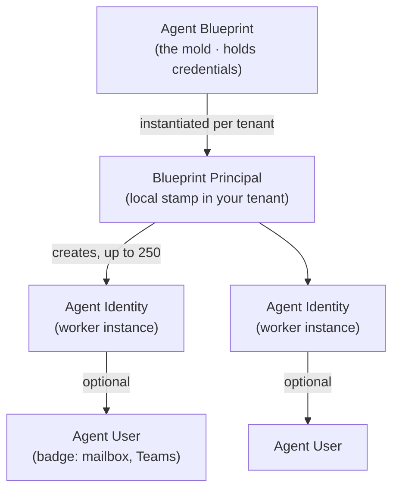

# Module 1 (Precursor) — What Is an Agent Identity? Breaking Down Entra Agent ID

**Slot in the day:** runs right after framing, *before* the Agent-in-a-Day labs. Goal: give learners
the identity mental model so that when they build in the labs, they recognize the Entra objects being
created — and the later blast-radius / attack / SOC modules land hard.

**Primary source:** Datadog Security Labs — "The Blueprint Blast Radius" (see `../grounding/`).
**Visuals:** `../grounding/reference-images.md` (Image 2 opener, Image 1 preview).
**Format:** one `##` = one slide. Convert to `.pptx` later.

---

## Slide 1 — Title
**What is an Agent Identity?**
Breaking down Microsoft Entra Agent ID — the identity layer under every agent you'll build today.

Speaker note: "Before we build a single agent, let's understand *what an agent actually is* in your
tenant. Spoiler: it's an identity."

---

## Slide 2 — First, what kind of thing are we identity-ing?
Use **Image 2** (Generative AI vs Agentic AI vs AI Agents).
- **Generative AI** — produces content (GPT, DALL·E).
- **Agentic AI** — automates tasks using tools + logic.
- **AI Agents** — act autonomously, interact with systems, learn from interactions.

Speaker note: "As we move left→right, the thing gets more autonomous and more connected to your
systems. The moment it *acts on your systems*, it needs an identity — and permissions."

---

## Slide 3 — The one-sentence definition
**An agent identity is a first-class Entra identity for an AI agent** — so an agent can authenticate,
be governed, and be monitored just like a user or service principal, but with agent-specific metadata
and controls.

> Microsoft: Entra Agent ID is "an identity and security framework that extends Microsoft Entra
> capabilities to AI agents."

---

## Slide 4 — You already know 90% of this (the app model)
Classic application model:
- **App registration** = the definition of an app.
- **Service principal** = its identity in a tenant (1 per tenant).

Speaker note: "Agent ID is built *on top of* this model. If you know app registrations and service
principals, you're most of the way there. Here's what's new."

---

## Slide 5 — The four new objects (plain language)
| Object | Think of it as | Built on |
|---|---|---|
| **Agent blueprint** | The **mold** — defines the agent + holds the credentials | App registration |
| **Blueprint principal** | The **local stamp** of that mold in *your* tenant | Service principal |
| **Agent identity** | The **worker** — an individual agent instance that does the work | Service principal |
| **Agent user** | The worker's **employee badge** — optional user account (mailbox, Teams) | User |

Key rule to remember: **credentials live only on the blueprint (the mold).**

---

## Slide 6 — How they relate (diagram)

One mold → one local stamp per tenant → many workers → each worker an optional badge.

---

## Slide 7 — Permissions: three ways an agent gets access
- **Direct** — app/delegated permissions or Entra roles assigned straight to the agent identity.
- **Inheritable** — defined on the blueprint, inherited by all its agent identities
  (*not visible on the identity itself* — you must look at the blueprint).
- **Restricted** — Microsoft blocks many Tier-0 roles/permissions (e.g., Global Admin)… **but not
  all** (Exchange Admin, Global Reader, `UserAuthMethod-*`, Azure Owner can still be assigned).

Speaker note: "Hold that last bullet — it's the seed of the risk we'll demo later."

---

## Slide 8 — How an agent authenticates (the important twist)
- Credentials sit **only on the blueprint (the mold)**.
- To act as an agent, the blueprint credential does a **two-hop token exchange**:
  blueprint → blueprint principal token → agent identity token.
- Meaning: **the blueprint holds the keys; the agent identity holds the permissions.**

One-liner: *whoever controls the mold can become any worker made from it.*

---

## Slide 9 — Why you should care (teaser, not the full attack)
- One blueprint can back **many** identities across **many** tenants.
- More identities + more permission contexts under **one** credential than a classic app.
- That's the **"blast radius"** — we'll walk the full cross-tenant attack later today.

Preview **Image 1** (Enterprise AI Security best practices) — "this is the map of where we're going:
identity, secrets, agent & tool security, monitoring & governance."

---

## Slide 10 — The bridge to what you're about to build
**When you build agents in today's labs (Agent in a Day / Copilot Studio), you are creating these
exact objects.** Latest Copilot Studio / Foundry / Security Copilot agents are created **with agent
identities.**

Watch for it: after Lab 2, we'll open **Entra ID → Agents** and find the blueprint, principal, and
agent identity your build just created.

Speaker note (sales seam): "So governance of these objects isn't optional add-on — it's the identity
layer of everything you'll build on Agent 365. That's the E7 identity-protection story."

---

## Slide 11 — Key takeaways
1. An agent is an **identity** (blueprint → principal → agent identity → optional agent user).
2. **Credentials live on the blueprint**; permissions live on the agent identity.
3. Some **Tier-0 permissions are still assignable** to agents → real risk.
4. **You'll create these objects in the labs** — then learn to see, secure, and detect them.

Next up: **Lab 1 — build your first declarative agent**, then we reveal its identity.
