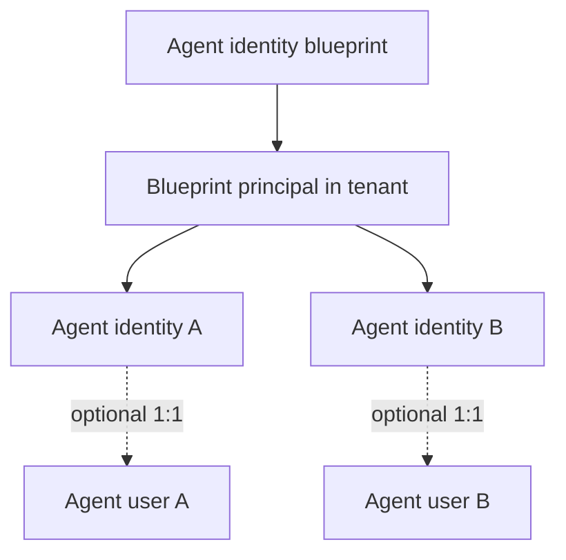
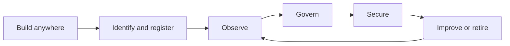

# Module 1 — Agents Are Identities

**Concepts and taxonomy for Microsoft Entra Agent ID and Microsoft Agent 365**

> 30-minute source deck. One `---` separator equals one slide. Detailed delivery notes are
> in [speaker-notes.md](speaker-notes.md).

---

# 1. Agents are identities

## The control plane for AI that can act

**Build → identify → authorize → observe → govern**

Today, every agent we build will cross that chain.

---

# 2. What you will be able to do

By the end of this module:

- classify AI by what it **does**;
- explain when identity becomes mandatory;
- distinguish **Entra Agent ID** from **Agent 365**;
- recognize the four core Agent ID objects;
- choose baseline controls for a simple agent scenario.

**Success test:** explain the control boundary in 60 seconds.

---

# 3. Stop arguing over labels—inspect behavior

| Behavior | Produces | Uses tools/data | Acts in systems | Human in the loop |
|----------|----------|-----------------|-----------------|-------------------|
| Generative experience | Content | Sometimes | Usually no | Prompt-by-prompt |
| Interactive agent | Answers + actions | Yes | On behalf of a user | Usually |
| Autonomous agent | Decisions + actions | Yes | Under its own identity | By exception |

The security question is not *“Does it use an LLM?”*

## It is: **What can it access, decide, and change?**

---

# 4. Autonomy changes the trust boundary

Moving right adds:

- more resources and permissions;
- more decisions outside direct human review;
- more durable impact;
- more need for identity, policy, logging, and containment.

---

# 5. Three scenarios

### A — Summarize a public report
Reads public text and produces a summary.

### B — Cancel an order after user approval
Reads customer data and invokes a business API for the signed-in user.

### C — Monitor refunds and remediate anomalies
Runs continuously, decides when to act, and updates business systems.

**Which scenario needs the strongest identity controls? Why?**

---

# 6. The moment an agent acts, identity becomes the control point

An enterprise must be able to answer:

| Question | Control |
|----------|---------|
| **Who** is acting? | Identity |
| **What** may it access? | Authorization |
| **Under whose authority?** | User delegation or workload identity |
| **What did it do?** | Audit and observability |
| **Who is accountable?** | Ownership and sponsorship |
| **How do we stop it?** | Policy, disable, and lifecycle controls |

No durable identity means weak attribution, inconsistent policy, and poor containment.

---

# 7. Microsoft Entra Agent ID

> An identity and security framework that extends Microsoft Entra capabilities to AI
> agents.

It provides purpose-built identity constructs so agents can be:

- **authenticated** and **authorized**;
- **discovered** and **inventoried**;
- protected by **access and risk controls**;
- governed through **ownership and lifecycle**;
- traced through **sign-in and audit logs**.

It supports agents built on Microsoft and non-Microsoft platforms.

---

# 8. Entra Agent ID ≠ Microsoft Agent 365

| Microsoft Entra Agent ID | Microsoft Agent 365 |
|--------------------------|---------------------|
| Identity and security framework | Enterprise control plane for agents |
| Purpose-built agent identity objects | Centralized observe, govern, secure experience |
| Authentication, authorization, policy, logs | Registry, administration, observability, security/compliance integration |
| Available to Microsoft Entra customers; advanced protections depend on licensing | Per-user licensed product; works best with Microsoft 365 E5/E7 |

## They work together

**Agent ID tells the enterprise who the agent is.**  
**Agent 365 helps the enterprise operate the agent fleet.**

---

# 9. A familiar foundation

| Traditional application model | Agent identity model |
|-------------------------------|----------------------|
| Application registration | Agent identity blueprint |
| Tenant-local service principal | Blueprint principal |
| One workload identity | One or more agent identities |
| Human user, if separately created | Optional agent user paired to an agent identity |

Agent ID builds on existing Entra object types—but adds an agent-aware hierarchy,
accountability, lifecycle, and logging model.

---

# 10. Four object names to recognize

| Object | Plain-language job | Recognition cue |
|--------|--------------------|-----------------|
| **Agent identity blueprint** | Template and authentication foundation | Defines common characteristics; holds authentication configuration |
| **Blueprint principal** | Records the blueprint's presence in a tenant | Tenant-local principal; appears in token/audit context |
| **Agent identity** | Primary identity used by an individual agent | Authenticates to systems and receives access |
| **Agent user** | Optional user-shaped account paired 1:1 | Mailbox, calendar, Teams, or user-only resources |

**Recognition rule:** an agent user supplements an agent identity—it does not replace it.

---

# 11. The hierarchy—only the map today

**One important preview:** agent identities do not hold credentials of their own; their
blueprint is the authentication foundation.

Authentication flow and blast radius belong to Modules 2 and 4.

---

# 12. Accountability is part of identity

| Relationship | Responsibility |
|--------------|----------------|
| **Owner** | Technical administration and configuration |
| **Sponsor** | Business accountability and lifecycle decisions |
| **Manager** | Operational/hiring-manager relationship for an agent user |

An agent should never be an unexplained object with permissions.

## Every agent needs a purpose, an accountable human, and an end date.

---

# 13. The operating model

- **Entra Agent ID:** identity, authentication, access, risk, lifecycle.
- **Agent 365:** centralized registry and observe/govern/secure experience.
- **Defender + Purview:** runtime threat defense and data protection.
- **XDR + Sentinel:** hunting, detection, investigation, and response.

---

# 14. Your turn — classify the control boundary

For each scenario:

1. Generative experience, interactive agent, or autonomous agent?
2. User-delegated or workload identity?
3. What is the highest-impact action?
4. Name one required preventive control.
5. Name one event the SOC should observe.

Work in pairs. **Four minutes.**

Use [exercise.md](exercise.md).

---

# 15. Debrief — behavior drives controls

| Scenario | Classification | Authority | Baseline control |
|----------|----------------|-----------|------------------|
| Public report summary | Generative | None/public | Input/output handling and logging |
| User-approved cancellation | Interactive agent | Delegated user | Least-privilege scope + user confirmation |
| Autonomous refund remediation | Autonomous agent | Workload/agent identity | Narrow permissions + policy + high-fidelity audit + kill switch |

Same model family. Very different trust boundaries.

**Controls follow capability—not the word “AI.”**

---

# 16. Four things to remember

1. Classify agents by **access, decisions, and actions**.
2. An acting agent needs a governed identity and attributable authority.
3. **Entra Agent ID** is the identity/security framework; **Agent 365** is the fleet control plane.
4. Blueprint → principal → agent identity → optional agent user is today's recognition map.

## Next: build the first agent—then find its identity.
