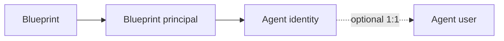

# Agent Identity 101 — Quick Reference

## Start with behavior

| Pattern | What it does | Typical authority |
|---------|--------------|-------------------|
| **Generative experience** | Produces content in response to a prompt | User session; may need no downstream enterprise access |
| **Interactive agent** | Uses data/tools and acts on behalf of a signed-in user | Delegated user authority |
| **Autonomous agent** | Runs independently, decides, and acts without a new prompt | Workload/agent identity |

Labels vary. Assess the real boundary:

> **What can it access? What can it decide? What can it change? Who authorized it?**

## Two products—different jobs

### Microsoft Entra Agent ID

The identity and security framework for AI agents. It provides purpose-built identities,
authentication and authorization, access/risk controls, lifecycle relationships, and
agent-aware logs.

### Microsoft Agent 365

The enterprise control plane for observing, governing, and securing agents. It provides a
central registry and connects administration, identity, data protection, and threat defense.

**Together:** Agent ID establishes *who the agent is*; Agent 365 helps operate the fleet.

## Four core objects

| Object | Remember it as |
|--------|----------------|
| **Agent identity blueprint** | Template and authentication foundation for one or more identities |
| **Blueprint principal** | Tenant-local record of the blueprint's presence |
| **Agent identity** | Primary identity an individual agent uses to access systems |
| **Agent user** | Optional paired user account for mailbox, calendar, Teams, or user-only resources |

**Important:** an agent identity has no credential of its own; authentication starts from
its blueprint. The detailed token flow is covered in Module 2.

## Six control questions

1. **Identity:** Who is acting?
2. **Authorization:** What may it access and change?
3. **Authority:** Is it acting for a user or as itself?
4. **Accountability:** Who owns and sponsors it?
5. **Observability:** Which sign-ins, decisions, and tool calls are recorded?
6. **Containment:** How is it disabled, rolled back, and retired?

## Accountability relationships

- **Owner:** technical administration.
- **Sponsor:** business accountability and lifecycle decisions.
- **Manager:** operational relationship for an optional agent user.

## Workshop map

- **Module 1:** vocabulary and control boundary.
- **Module 2:** object anatomy and authentication.
- **Module 3:** permissions and tools.
- **Module 4:** attack paths and blueprint blast radius.
- **Module 5:** detect, respond, and govern.
- **Module 6:** apply the model in the CTF.

## Primary references

- [What is Microsoft Entra Agent ID?](https://learn.microsoft.com/entra/agent-id/what-is-microsoft-entra-agent-id)
- [Fundamental concepts in Microsoft Entra Agent ID](https://learn.microsoft.com/entra/agent-id/key-concepts)
- [Microsoft Agent 365 overview](https://learn.microsoft.com/microsoft-agent-365/overview)
